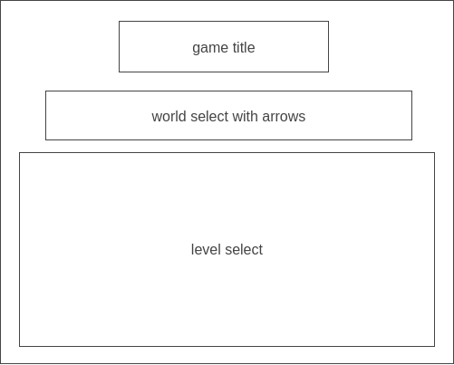
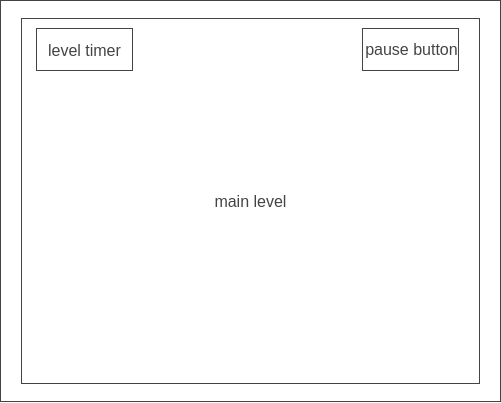

# Otherworlds

## Overview

A space themed game with sets of levels taking place in a world with certain properties. The first world will be like a tutorial
world with regular gravity and no gimmicks. The goal for each level is to get the the door at the end of the level. The last 
level in a world (~5 levels per world) will have a portal to the next world. Simple 8 bit graphics. Levels will be short and there
will be no side scrolling all the content for a level wil fit on screen.

## MVP List

Functionality 1 - Main Character sprite + movement, Game Physics
* main character can be controlled to move around using wasd and space bar
* gravity works for jumping and platforms break fall

Functionality 2 - World 1
* first world 3 levels long

Bonus - more worlds (~3-5 levels)

## Wireframes

## Architecture & Technology

Otherworlds will be built using Javascript, HTML, and CSS.

## Implementation Timeline

### Day 1
* General set up
* Prepare character, home screen, and level 1 assets
* Complete home page

### Day 2
* Set up player movement and animations
* Start level 1

### Day 3
* Finish level 1 and 2

### Day 4
* Finish level 3
* Begin work on second world

